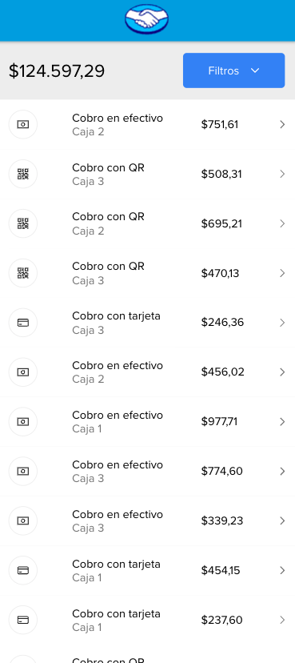

<h1 align="center">Challenge Mercado Pago 💲</h1>

<p align="center">


</p>

## Tecnologias utlizadas
Para el frontend estoy utilizando React con Vite y Typescript, con Sass y CSSModules.
Para el backend estoy utilizando Node, Express, CORS y Typescript.

## Como correr el proyecto

Para clonar e instalar este challenge necesitan [Git](https://git-scm.com), [Node.js](https://nodejs.org/en/download/) y [Npm](https://www.npmjs.com/) en la computadora. Desde la terminal:

```bash
# Clonar el repo
$ git clone git@github.com:celestedubini/challenge-mercado-pago.git
```

Hay dos carpetas: una de frontend y otra de la API. Para instalar las dependencias de ambos deben pararse en cada carpeta y correr
```bash
# Instalar dependencias
$ npm i
```

Primero hay que levantar la API corriendo en la carpeta de API:
```bash
$ npm run dev
```

Luego se puede levantar el frontend corriendo en su carpeta:
```bash
npm run dev
```

Abri [http://localhost:3000](http://localhost:3000) con tu navegador para ver el resultado. La api está corriendo en [http://localhost:3001](http://localhost:3001).

En caso de querer generar nuevamente el archivo `data.json`, se debe correr por separado, y luego volver a ejecutar `npm run dev` para levantar la API.
```bash
# Regenerar el json
npm run start
```

